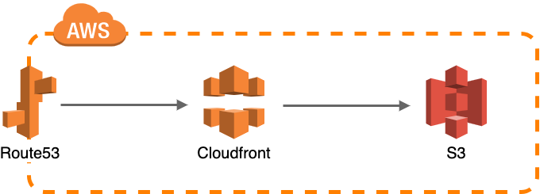

# [Portfolio Site](https://csarko.sh) &middot; 
The purpose of this project is to demonstrate a website with [100/100 performance rating on Google Lighthouse](https://developers.google.com/speed/pagespeed/insights/?url=https%3A%2F%2Fcsarko.sh%2F&tab=desktop) and to serve as my portfolio website.

## Architecture

